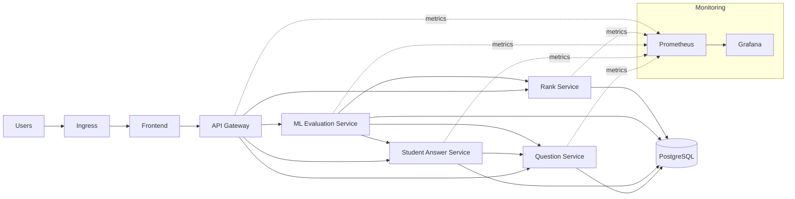

# Kubernetes Orchestration Architecture (EvalIQ)

High‑level architecture for orchestrating this system on Kubernetes, focusing on components, responsibilities, and operational concerns—without detailed manifests.

This plan is inspired by the “Example Voting App” production‑grade checklist and adapted to this project.

---

## 1) System Topology

**Namespaces**
- `evaliq` — application workloads
- `evaliq-monitoring` — observability stack

**Workload types**
- **Stateless:** api-gateway, question-service, student-answer-service, ml-evaluation-service, rank-service, frontend
- **Stateful:** PostgreSQL, Prometheus, Grafana

---

## 2) Services (Owned Independently)

Each microservice is treated as independently owned (separate repos, CI/CD, and release cycles).

**Core services**
- Frontend (React)
- API Gateway
- Question Service
- Student Answer Service
- ML Evaluation Service
- Rank Service

**Platform services**
- PostgreSQL (database)
- Prometheus (metrics)
- Grafana (dashboards)

---

## 3) Service Map (Traffic Flow)

**Ingress → Frontend → API Gateway → Backend Services → Database**

**Internal calls**
- api-gateway → question-service, student-answer-service, ml-evaluation-service, rank-service
- student-answer-service → question-service
- ml-evaluation-service → question-service, student-answer-service, rank-service

### Diagram (High‑Level)

---

## 4) Networking Architecture

- **ClusterIP Services** for internal communication
- **Ingress** for external access (frontend + api-gateway)
- **NetworkPolicies** to allow only required service‑to‑service traffic

---

## 5) Statefulness & Data

- PostgreSQL runs as a **StatefulSet** with **persistent storage**
- Use a **managed DB** in production when possible
- Backups and retention policies are required for DB and monitoring data

---

## 6) Health & Reliability

- **Readiness probes**: only route traffic when services are ready
- **Liveness probes**: restart unhealthy containers
- **Startup probes**: for ML service (model load time)

---

## 7) Scaling Strategy

- **Horizontal Pod Autoscaling** for stateless services
- **Vertical scaling** (resources) for ML evaluation
- **Pod Disruption Budgets** to ensure availability during maintenance

---

## 8) Security Posture

- Secrets for database credentials
- Non‑root containers where possible
- Restricted network access with NetworkPolicies
- TLS at ingress (cert‑manager recommended)

---

## 9) Observability

- **Prometheus** for metrics scraping
- **Grafana** dashboards for SLOs, latency, error rates, and resource usage
- Centralized logs (optional: Loki/ELK)

---

## 10) Configuration Model

- **ConfigMap** for service URLs and non‑sensitive settings
- **Secret** for credentials and tokens
- Versioned images for reproducible deployments

---

## 11) Release & Operations

- Rolling updates for stateless services
- Canary or blue/green for frontend and API gateway
- Backup/restore drills for stateful data

---

## 12) Key Recommendations

- Add lightweight `/health` endpoints per service
- Keep ML service isolated with dedicated resources
- Enforce minimum replicas for critical services
- Use Kustomize/Helm for multi‑environment setup

---

## 13) Production‑Grade Expectations (Checklist)

- **Separate repository per microservice** (source, Dockerfile, manifests, README)
- **Deployments** with labels/selectors, rolling updates, and resource requests/limits
- **Services**
	- ClusterIP for internal
	- NodePort only where external access is required (no LoadBalancer)
- **Ingress** for external entry (host/path based routing)
- **HPA** for all stateless services (CPU based scaling)
- **Probes** (liveness/readiness) on every container
- **PDBs** for critical services
- **ConfigMaps & Secrets** for configuration and credentials
- **Namespace isolation**
- **Security context** (non‑root, least privilege)
- **Service accounts & RBAC**
- **Network policies** for least‑privilege traffic
- **Observability** (metrics endpoints, Prometheus scrape targets)
- **Affinity/Anti‑Affinity** to spread pods across nodes

---

## 14) Cost‑Aware Deployment Notes (Student Guidance)

- Prefer **spot instances** for lab clusters
- Use **NodePort + Ingress**, avoid cloud LoadBalancers
- Terminate instances when not in use
- Monitor daily costs and set budgets/alerts

---

## 15) Implementation Guidance (How Others Should Execute)

This section explains the expected implementation approach at a practical level, without prescribing exact YAML.

### A) Per‑Service Repositories

Each service should be moved to its own repo and include:
- Source code
- Dockerfile
- K8s manifests folder (base + environment overlays)
- README with runbook

Expected repos for this system:
- frontend
- api-gateway
- question-service
- student-answer-service
- ml-evaluation-service
- rank-service
- postgres (optional repo if self‑managed)
- monitoring (Prometheus/Grafana)

### B) Build & Image Strategy

- Build images in CI per repo
- Use semantic tags plus Git SHA tags
- Publish to a registry accessible by the cluster

### C) Deployment Strategy (Per Service)

For each stateless service:
- Deployment with rolling updates
- Resource requests/limits
- Liveness + readiness probes
- HPA based on CPU
- PDB to maintain availability

For stateful services:
- StatefulSet with persistent storage
- Backup strategy and retention policy

### D) Networking & Ingress

- All internal service‑to‑service traffic uses ClusterIP
- External access only via Ingress
- Frontend routes user traffic; API Gateway is the only API entry
- NetworkPolicies restrict non‑required paths

### E) Configuration & Secrets

- ConfigMaps for non‑sensitive settings
- Secrets for credentials and API keys
- Services must read config from environment variables

### F) Security Baseline

- Run containers as non‑root
- Minimal privileges and read‑only FS when possible
- Service accounts with least‑privilege RBAC

### G) Observability

- Expose metrics endpoints from services
- Prometheus scrapes each service
- Grafana dashboards for latency, errors, throughput, resource usage

### H) Documentation Expectations

Each repo must include:
- Architecture diagram
- Deployment steps (dev + prod)
- Scaling strategy explanation
- Failure‑handling approach
- Trade‑offs and assumptions

---

## 16) Overview — What to Add Where

High‑level placement guide (no detailed manifests):

**Project root**
- orchestration.md (this guide)
- infra/k8s/ (recommended for platform‑level manifests)

**Each service repo**
- Dockerfile
- k8s/ (Deployment, Service, HPA, PDB, NetworkPolicy as applicable)
- README.md (architecture + deployment steps)

**Platform/infra repo (or infra/k8s)**
- Namespace definitions
- Ingress rules
- Shared ConfigMaps/Secrets
- Monitoring stack (Prometheus/Grafana)
- PostgreSQL StatefulSet (if self‑managed)
