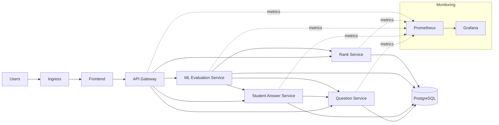

# Kubernetes Orchestration Architecture (EvalIQ)

High‑level architecture for orchestrating this system on Kubernetes, focusing on components, responsibilities, and operational concerns—without detailed manifests.

---

## 1) System Topology

**Namespaces**
- `evaliq` — application workloads
- `evaliq-monitoring` — observability stack

**Workload types**
- **Stateless:** api-gateway, question-service, student-answer-service, ml-evaluation-service, rank-service, frontend
- **Stateful:** PostgreSQL, Prometheus, Grafana

---

## 2) Service Map (Traffic Flow)

**Ingress → Frontend → API Gateway → Backend Services → Database**

**Internal calls**
- api-gateway → question-service, student-answer-service, ml-evaluation-service, rank-service
- student-answer-service → question-service
- ml-evaluation-service → question-service, student-answer-service, rank-service

### Diagram (High‑Level)

---

## 3) Networking Architecture

- **ClusterIP Services** for internal communication
- **Ingress** for external access (frontend + api-gateway)
- **NetworkPolicies** to allow only required service‑to‑service traffic

---

## 4) Statefulness & Data

- PostgreSQL runs as a **StatefulSet** with **persistent storage**
- Use a **managed DB** in production when possible
- Backups and retention policies are required for DB and monitoring data

---

## 5) Health & Reliability

- **Readiness probes**: only route traffic when services are ready
- **Liveness probes**: restart unhealthy containers
- **Startup probes**: for ML service (model load time)

---

## 6) Scaling Strategy

- **Horizontal Pod Autoscaling** for stateless services
- **Vertical scaling** (resources) for ML evaluation
- **Pod Disruption Budgets** to ensure availability during maintenance

---

## 7) Security Posture

- Secrets for database credentials
- Non‑root containers where possible
- Restricted network access with NetworkPolicies
- TLS at ingress (cert‑manager recommended)

---

## 8) Observability

- **Prometheus** for metrics scraping
- **Grafana** dashboards for SLOs, latency, error rates, and resource usage
- Centralized logs (optional: Loki/ELK)

---

## 9) Configuration Model

- **ConfigMap** for service URLs and non‑sensitive settings
- **Secret** for credentials and tokens
- Versioned images for reproducible deployments

---

## 10) Release & Operations

- Rolling updates for stateless services
- Canary or blue/green for frontend and API gateway
- Backup/restore drills for stateful data

---

## 11) Key Recommendations

- Add lightweight `/health` endpoints per service
- Keep ML service isolated with dedicated resources
- Enforce minimum replicas for critical services
- Use Kustomize/Helm for multi‑environment setup
